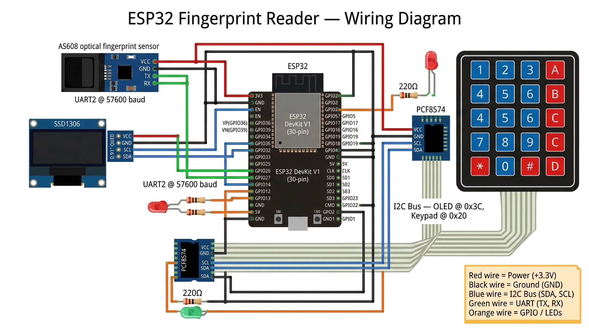

# Fingerprint Reader PoC

Proof-of-concept biometric attendance/authentication system built with Arduino-compatible boards and an AS608 optical fingerprint sensor. Developed at **PALO IT**.

These codes demonstrate Serial communication between Atmega328P MCU and ESP8266.

---

## Mobile App – Enroll via Apple Touch ID / Android Fingerprint

The `mobile/` directory contains a **React Native (Expo)** app that lets you
enroll and verify fingerprints using your phone's built-in biometric sensor:

| Platform | Supported sensors |
|----------|-------------------|
| iOS      | Touch ID, Face ID |
| Android  | Fingerprint, Face Unlock (device-dependent) |

### How it works

The mobile app mirrors the same API contract used by the Arduino/ESP32 firmware.
After a successful biometric prompt the app sends:

```json
{ "api_key": "<your key>", "id": <slot 1-127> }
```

to the same backend endpoint, so the server sees a mobile verification exactly
like a hardware sensor scan.

### Setup

#### 1. Install dependencies

```bash
cd mobile
npm install
```

#### 2. Configure the API endpoint

```bash
cp mobile/secrets.example.js mobile/secrets.js
```

Edit `mobile/secrets.js` and fill in your `HOST` URL and `API_KEY`:

```js
export const HOST = "https://your-api-host/fingerprint-endpoint";
export const API_KEY = "your-api-key-here";
```

> `secrets.js` is listed in `.gitignore` and will never be committed.

#### 3. Run on device

```bash
# iOS simulator / physical device (requires macOS + Xcode)
cd mobile && npx expo start --ios

# Android emulator / physical device
cd mobile && npx expo start --android
```

Or start Expo Dev Server and scan the QR code with the **Expo Go** app:

```bash
cd mobile && npx expo start
```

### App screens

| Screen | Description |
|--------|-------------|
| **Home** | Choose between Enroll and Verify |
| **Enroll** | Enter a slot ID (1–127), authenticate with Touch ID/Fingerprint, and register the enrollment with the backend |
| **Verify** | Enter your slot ID, authenticate with Touch ID/Fingerprint, and notify the backend of a successful verification |

### iOS – required permission

The `NSFaceIDUsageDescription` key is already set in `mobile/app.json`.
When building a production `.ipa` you do **not** need to add it manually.

### Android – required permissions

`USE_BIOMETRIC` and `USE_FINGERPRINT` are already declared in `mobile/app.json`.

---
## Overview

This project demonstrates fingerprint enrollment, reading, and backend notification using two hardware architectures:

| Architecture | MCU | WiFi | Use Case |
|---|---|---|---|
| **Dual-chip** | Arduino Uno R3 (Atmega328P + ESP8266) | ESP8266 as WiFi bridge | Budget build using the cheap Chinese combo board with 8 DIP switches |
| **Single-chip** | ESP32 | Built-in WiFi | Cleaner setup, more capable, all-in-one |

### How It Works

1. A fingerprint is scanned using the **AS608 sensor**
2. The matched fingerprint ID is displayed on a **128x32 SSD1306 OLED**
3. The ID is sent via **HTTPS POST** to a backend API as JSON: `{"api_key":"...","id":<n>}`
4. LED indicators show status: **green** = ready, **red** = processing/error

## Hardware Components

| Component | Model / Spec | Interface |
|---|---|---|
| Fingerprint Sensor | AS608 optical | UART (57600 baud) |
| OLED Display | SSD1306 128x32 | I2C (address `0x3C`) |
| Keypad (optional) | 4x4 matrix via PCF8574 | I2C (address `0x20`) |
| Status LEDs | Red (pin 12), Green (pin 13) | Digital GPIO |

## Wiring

### Arduino Uno R3 (Atmega328P side)

```
OLED SSD1306         Arduino
  SCL  ----------->  A5
  SDA  ----------->  A4
  GND  ----------->  GND
  VCC  ----------->  5V

AS608 Fingerprint    Arduino
  TX   ----------->  D2 (SoftwareSerial RX)
  RX   ----------->  D3 (SoftwareSerial TX)
  GND  ----------->  GND
  VCC  ----------->  3.3V
```

### ESP32

```
OLED SSD1306         ESP32
  SCL  ----------->  SCL (default I2C)
  SDA  ----------->  SDA (default I2C)
  GND  ----------->  GND
  VCC  ----------->  3.3V

AS608 Fingerprint    ESP32
  TX   ----------->  GPIO4 (Serial2 RX)
  RX   ----------->  GPIO25 (Serial2 TX)
  GND  ----------->  GND
  VCC  ----------->  3.3V

I2C Keypad (PCF8574) ESP32
  SCL  ----------->  SCL (shared I2C bus)
  SDA  ----------->  SDA (shared I2C bus)
```

### Wiring Diagram (ESP32 Full-Featured)



## Project Structure

```
├── enroll/                # Arduino: Enroll fingerprints via Serial Monitor + OLED
├── reader/                # Arduino: Read fingerprints, send ID to ESP8266 via Serial
├── enroll_read/           # Arduino: Combined enroll + read with I2C keypad mode selection
├── esp8266_send/          # ESP8266: WiFi bridge — receives IDs from Arduino, POSTs to backend
├── esp32/
│   ├── enroll/            # ESP32: Enroll fingerprints via Serial Monitor
│   ├── reader/            # ESP32: Read fingerprints + OLED display
│   └── enroll_read/       # ESP32: Full-featured (Reader, Enroll, Delete, Status) with WiFi + keypad
├── i2c_scanner/           # Utility: Scan I2C bus for connected device addresses
└── secrets.h              # (gitignored) WiFi credentials, API key, backend host
```

### Sketch Details

| Sketch | Platform | Modes | Peripherals | WiFi |
|---|---|---|---|---|
| `enroll/` | Arduino | Enroll only (Serial input) | OLED, Fingerprint | No |
| `reader/` | Arduino | Read only | OLED, Fingerprint, LEDs | Via ESP8266 |
| `enroll_read/` | Arduino | A) Reader, B) Enroll (keypad) | OLED, Fingerprint, Keypad, LEDs | Via ESP8266 |
| `esp8266_send/` | ESP8266 | WiFi bridge | None (Serial only) | Yes |
| `esp32/enroll/` | ESP32 | Enroll only (Serial input) | Fingerprint | No |
| `esp32/reader/` | ESP32 | Read only | OLED, Fingerprint | No (prepared) |
| `esp32/enroll_read/` | ESP32 | A) Reader, B) Enroll, C) Delete, D) Status | OLED, Fingerprint, Keypad, LEDs | Yes (direct) |
| `i2c_scanner/` | Any | Utility | I2C bus | No |

### Dual-Chip Serial Protocol (Arduino + ESP8266)

The Atmega328P and ESP8266 communicate over shared UART at **115200 baud**:

| Direction | Message | Meaning |
|---|---|---|
| ESP8266 → Arduino | `[ESP8266]READY\n` | WiFi connected, ready to receive |
| Arduino → ESP8266 | `[F_ID]<id>\n` | Fingerprint ID matched, please POST |
| ESP8266 → Arduino | `[ESP8266]<httpCode>\n` | HTTP response code from backend |

## Setup

### Prerequisites

Install the following Arduino libraries (via Library Manager or manually):

- [Adafruit Fingerprint Sensor Library](https://github.com/adafruit/Adafruit-Fingerprint-Sensor-Library)
- [Adafruit SSD1306](https://github.com/adafruit/Adafruit_SSD1306)
- [Adafruit GFX Library](https://github.com/adafruit/Adafruit-GFX-Library)
- [Keypad](https://github.com/Chris--A/Keypad) (for enroll_read sketches)
- [Keypad_I2C](https://github.com/joeyoung/arduino_keypads) (for enroll_read sketches)

### Configuration

Create a `secrets.h` file in the sketch directory that needs WiFi:

```cpp
// secrets.h
const char *ssid = "YOUR_WIFI_SSID";
const char *password = "YOUR_WIFI_PASSWORD";
const char *apiKey = "YOUR_API_KEY";

#define HOST "https://your-backend-api.example.com/endpoint"

// ESP8266 only — SSL certificate fingerprint of the backend
#define FINGERPRINT "AA BB CC DD EE FF 00 11 22 33 44 55 66 77 88 99 AA BB CC DD"
```

### Uploading

1. **Arduino Uno R3 (combo board):** Set DIP switches to route Serial to Atmega328P for upload, then switch back for runtime communication with ESP8266.
2. **ESP32:** Select your ESP32 board in Arduino IDE and upload directly.

## Dependencies

| Library | Used By |
|---|---|
| `Adafruit_Fingerprint` | All sketches |
| `Adafruit_SSD1306` | All except `esp8266_send`, `i2c_scanner` |
| `Adafruit_GFX` | All except `esp8266_send`, `i2c_scanner` |
| `SoftwareSerial` | Arduino sketches only |
| `Keypad` + `Keypad_I2C` | `enroll_read/`, `esp32/enroll_read/` |
| `WiFi` / `ESP8266WiFi` | `esp8266_send/`, `esp32/enroll_read/` |
| `HTTPClient` | `esp8266_send/`, `esp32/enroll_read/` |
| `WiFiClientSecure` | `esp8266_send/`, `esp32/enroll_read/` |

## License

This project is a proof-of-concept by PALO IT.
